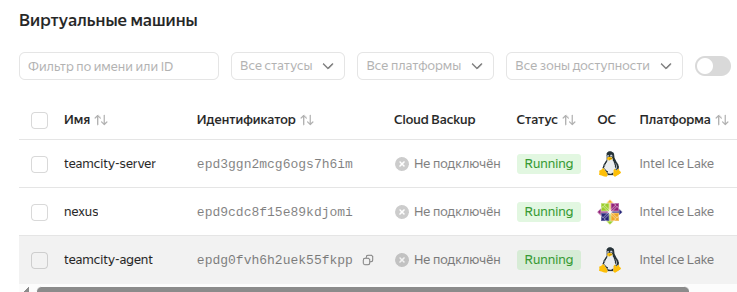
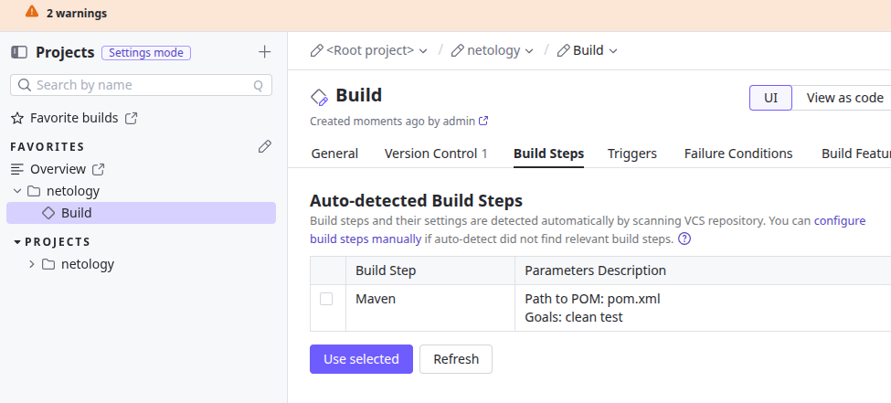
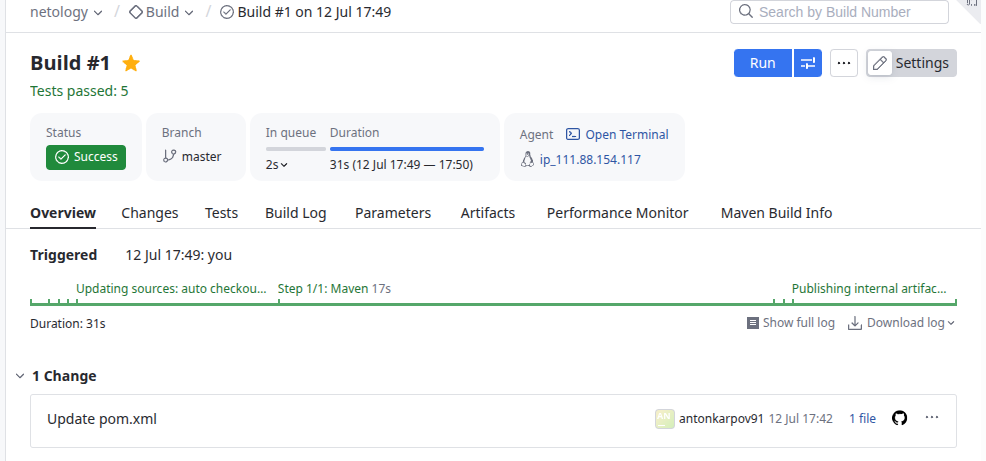
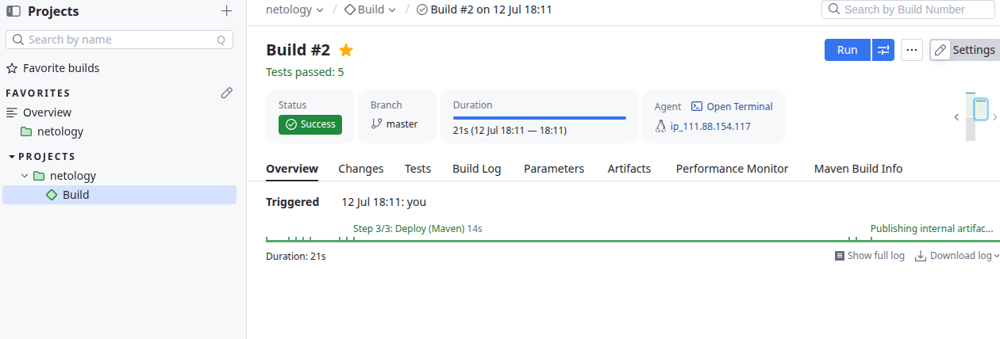
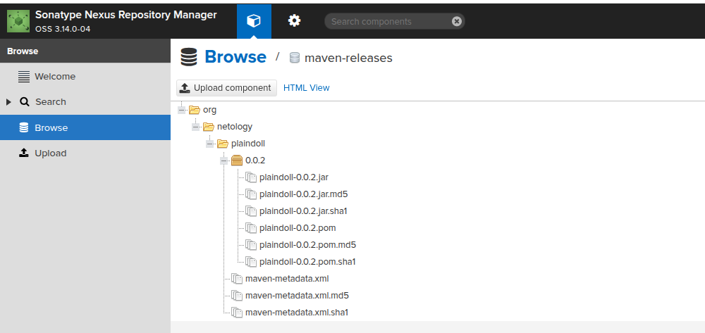
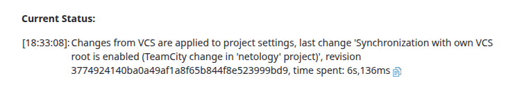
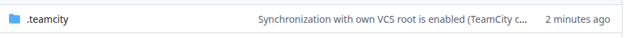
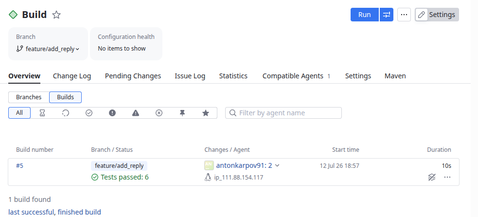
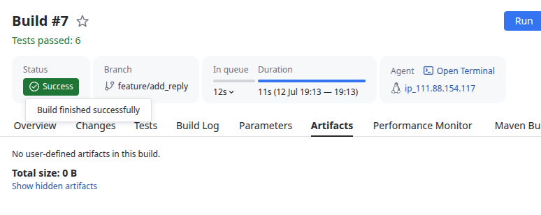
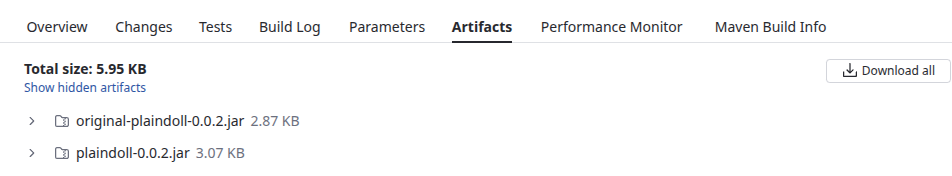

## Домашнее задание к занятию 11 «Teamcity». Карпов Антон Юрьевич

### Подготовка к выполнению

1. В Yandex Cloud создайте новый инстанс (4CPU4RAM) на основе образа jetbrains/teamcity-server.
2. Дождитесь запуска teamcity, выполните первоначальную настройку.
3. Создайте ещё один инстанс (2CPU4RAM) на основе образа jetbrains/teamcity-agent. Пропишите к нему переменную окружения SERVER_URL: "http://<teamcity_url>:8111".
4. Авторизуйте агент.
5. Сделайте fork репозитория.
6. Создайте VM (2CPU4RAM) и запустите playbook.

### Основная часть

1. Создайте новый проект в teamcity на основе fork.
2. Сделайте autodetect конфигурации.
3. Сохраните необходимые шаги, запустите первую сборку master.
4. Поменяйте условия сборки: если сборка по ветке master, то должен происходит mvn clean deploy, иначе mvn clean test.
5. Для deploy будет необходимо загрузить settings.xml в набор конфигураций maven у teamcity, предварительно записав туда креды для подключения к nexus.
6. В pom.xml необходимо поменять ссылки на репозиторий и nexus.
7. Запустите сборку по master, убедитесь, что всё прошло успешно и артефакт появился в nexus.
8. Мигрируйте build configuration в репозиторий.
9. Создайте отдельную ветку feature/add_reply в репозитории.
10. Напишите новый метод для класса Welcomer: метод должен возвращать произвольную реплику, содержащую слово hunter.
11. Дополните тест для нового метода на поиск слова hunter в новой реплике.
12. Сделайте push всех изменений в новую ветку репозитория.
13. Убедитесь, что сборка самостоятельно запустилась, тесты прошли успешно.
14. Внесите изменения из произвольной ветки feature/add_reply в master через Merge.
15. Убедитесь, что нет собранного артефакта в сборке по ветке master.
16. Настройте конфигурацию так, чтобы она собирала .jar в артефакты сборки.
17. Проведите повторную сборку мастера, убедитесь, что сбора прошла успешно и артефакты собраны.
18. Проверьте, что конфигурация в репозитории содержит все настройки конфигурации из teamcity.
19. В ответе пришлите ссылку на репозиторий.

### Решение

Созданы 3 ВМ:

Создан проект в teamcity на основе forkрепозитория, автоматически определился maven:

Запущена сборка:

Созданы 2 шага - Test и Deploy, запущена сборка:

Результат в Nexus:

Мигрирован build configuration в репозиторий:

Автоматический запуск в новой ветке после внесения изменений в файлы:

Сборка после слияния, отсутствие артефактов:

Jar-файлы в Artifacts после настройки и сборки:

Убеждаемся, что в репозитории сохранены все настройки:

https://github.com/Entony/example-teamcity/blob/master/.teamcity/settings.kts

Ссылка на репозиторий:

https://github.com/Entony/example-teamcity.git
